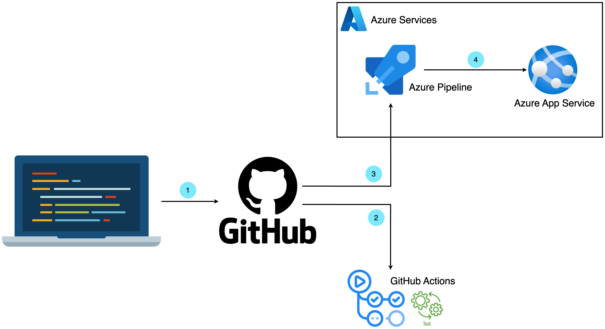

# Udacity Nanodegree: Cloud DevOps using Microsoft Azure - Project: Building a CI/CD Pipeline

[](https://github.com/congdinh2008/azure-devops-cicd-pipeline-udacity-prj2/actions/workflows/pythonapp.yml)

## Table of Contents

- [Overview](#overview)
- [Project Plan](#project-plan)
- [Instructions](#instructions)
  - [Architectural Overview](#architectural-overview)
  - [Dependencies](#dependencies)
  - [Getting Started](#getting-started)
- [Run Locust Test](#run-locust-test)
- [Deployment via Terraform](#deployment-via-terraform)
- [Enhancements](#enhancements)
- [Screenshots](#screenshots)
- [Demo](#demo)

## Overview

The final project, "Building a CI/CD Pipeline," focuses on creating a continuous integration and continuous delivery (CI/CD) pipeline for a Python-based machine learning application. Here's an overview of the project:

1. Project Description:

   The project involves building a GitHub repository from scratch and setting up a CI/CD pipeline.
   You'll work with a pre-trained machine learning model that predicts housing prices in Boston based on various features.
   The application is built using the Flask web framework, and you'll create an API to serve predictions.

2. Continuous Integration (CI):

   You'll utilize GitHub Actions, a CI/CD platform, to set up a workflow for performing linting, testing, and installation tasks.
   A Makefile will be used to define these tasks, including linting the code, running tests, and installing dependencies from the requirements.txt file.
   The CI process ensures that code changes are validated and tested before being integrated into the main codebase.

3. Continuous Delivery (CD):

   You'll integrate the project with Azure Pipelines, another CI/CD platform, to enable continuous delivery to Azure App Service.
   The CD process automates the deployment of the application to a production-like environment.
   By configuring Azure Pipelines, you'll ensure that new code changes are automatically built, tested, and deployed to Azure App Service.

4. Flask Application and API:

   The project includes an app.py file that serves the Flask application.
   The application provides an API endpoint to make predictions about housing prices based on input features.
   You'll operationalize the Flask app, allowing it to handle incoming API requests and respond with predictions.

5. Machine Learning Model:

   A pre-trained scikit-learn model is provided, which predicts housing prices in Boston.
   The model takes input features such as average rooms, highway access data, and teacher-to-pupil ratios to make predictions.
   You'll incorporate this model into the Flask application and expose it through the API.

6. Project Extension:

   The project can be extended to incorporate other pre-trained machine learning models, such as those used for image recognition or data labeling.
   The focus is on operationalizing the Flask app and enabling CI/CD, providing a foundation for deploying and scaling machine learning models.

Throughout the project, you'll demonstrate your ability to implement CI/CD best practices, work with GitHub Actions and Azure Pipelines, deploy the Flask app to Azure App Service, and effectively utilize pre-trained machine learning models.

## Project Plan

- Trello board: [Trello Board](https://trello.com/b/s1R4grRJ/udacity-project-02)
- Project plan spreadsheet: [Project Plan](https://docs.google.com/spreadsheets/d/1PYAvg4aIAuOIKJTZRNR7Z1zfOQbZVHcQm-9AR2XjaZg/edit?usp=sharing)

## Instructions

### Architectural overview



1. Developer pushes code to GitHub
2. GitHub Actions run make file
3. Azure Pipelines integrated with GitHub to run make file and deploy code to Azure App Service
4. Azure App Service run the Flask web

### Dependencies

1. Create a [GitHub Account](https://github.com)
2. Create an [Azure Account](https://portal.azure.com)
3. Install [Terraform](https://developer.hashicorp.com/terraform/downloads?product_intent=terraform)
4. Install [Python](https://www.python.org/downloads/)
5. Install [Azure CLI](https://learn.microsoft.com/en-us/cli/azure/install-azure-cli?view=azure-cli-latest)
6. Install [Visual Studio Code](https://code.visualstudio.com/)

### Getting Started

1. Get Azure Account information:

   - AZ_SUBSCRIPTION_ID=00000000-0000-0000-0000-000000000000
   - AZ_TENANT_ID=00000000-0000-0000-0000-000000000000
   - AZ_CLIENT_ID=00000000-0000-0000-0000-000000000000
   - AZ_CLIENT_SECRET=000000000000000000000

2. Export Azure Account information variables
   - Run the following command
     ```bash
     export AZ_SUBSCRIPTION_ID=00000000-0000-0000-0000-000000000000
     export AZ_TENANT_ID=00000000-0000-0000-0000-000000000000
     export AZ_CLIENT_ID=00000000-0000-0000-0000-000000000000
     export AZ_CLIENT_SECRET=000000000000000000000
     ```
3. Connect Github with Azure Cloud Shell
   - SSH key generated:
     ```bash
     ssh-keygen -t rsa
     ```
   - Show and copy key:
     ```bash
     cat ~/.ssh/id_rsa.pub
     ```
   - Add new key to your GitHub profile (Settings => SSH keys > Add New)
   - Clone repository from GitHub to Azure Cloud Shell
     ```bash
     git clone git@github.com:congdinh2008/azure-devops-cicd-pipeline-udacity-prj2.git
     ```
4. Run and deploy the project
   - cd into the project directory
     ```bash
     cd azure-devops-cicd-pipeline-udacity-prj2
     ```
   - Run make file to install dependencies
     ```bash
     make install
     ```
   - Create an Azure App Service and deploy the project to the app
     ```bash
     az webapp up --name udacity-project2-app -g udacity-project2-rg --sku B1 --logs --runtime "PYTHON:3.9.14" -l "southeastasia"
     ```
5. Double check the app service running

   - Go to the Azure App Service url: https://udacity-project2-app.azurewebsites.net
   - Website showing "Sklearn Prediction Home" as success

6. Run a script to predict
   ```bash
   cat make_predict_azure_app.sh && echo "Run prediction script: " && ./make-predict_azure_app.sh
   ```
7. Destroy Azure resources after completion

## Run Locust Test

1. Goto the project directory
2. Run the script

   ```bash
   locust
   ```

3. Access link: http://0.0.0.0:8089
4. Run and check report

## Deployment via Terraform

1. Get Azure Account information:

- AZ_SUBSCRIPTION_ID=00000000-0000-0000-0000-000000000000
- AZ_TENANT_ID=00000000-0000-0000-0000-000000000000
- AZ_CLIENT_ID=00000000-0000-0000-0000-000000000000
- AZ_CLIENT_SECRET=000000000000000000000

2. Goto the project directory

3. Run Terraform to create Azure App Service

   ```bash
   cd terraform
   terraform init
   terraform plan -out solution.plan
   terraform apply "solution.plan"
   ```

4. Deploy the project to the Azure App Service

   ```bash
   az webapp up --name udacity-project2-app -g udacity-project2-rg --sku B1 --logs --runtime "PYTHON:3.9.14" -l "southeastasia"
   ```

5. Destroy Azure resources after completion

## Enhancements

- You can also use Azure DevOps repository to replace GitHub Repository
- Use Azure DevOps Services completely instead of GitHub Action
- Use Git Branchs to split into dev/features/release branches to avoid pushing code straight to production

## Screenshots: 
- All screenshots in the screenshot directory: [Screenshots](https://github.com/congdinh2008/azure-devops-cicd-pipeline-udacity-prj2/tree/main/screenshots)

- Project running on Azure App Service


- Project cloned into Azure Cloud Shell


- Passing tests that are displayed after running the `make all` command from the `Makefile`
  

- Output of a test run

- Successful deploy of the project in Azure Pipelines. [Note the official documentation should be referred to and double checked as you setup CI/CD](https://docs.microsoft.com/en-us/azure/devops/pipelines/ecosystems/python-webapp?view=azure-devops).

- Running Azure App Service from Azure Pipelines automatic deployment
  


- Successful prediction from deployed flask app in Azure Cloud Shell. [Use this file as a template for the deployed prediction](https://github.com/udacity/nd082-Azure-Cloud-DevOps-Starter-Code/blob/master/C2-AgileDevelopmentwithAzure/project/starter_files/flask-sklearn/make_predict_azure_app.sh).
  The output should look similar to this:

  ```bash
  udacity@Azure:~$ ./make_predict_azure_app.sh
  Port: 443
  {"prediction":[20.35373177134412]}
  ```
  


- Output of streamed log files from deployed application
  

## Demo
Youtube Video link is in the note of the submission.
